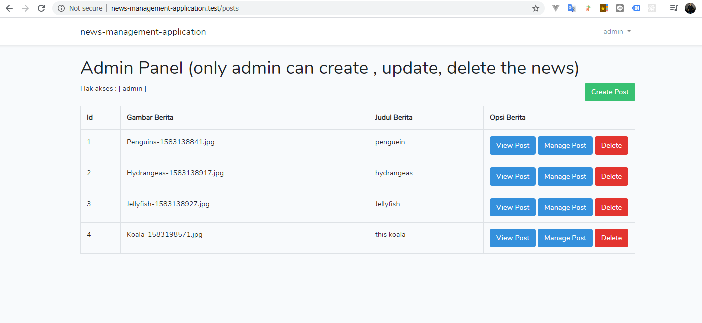
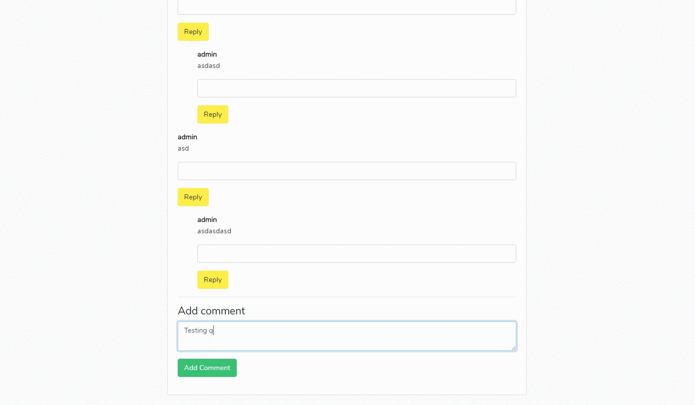
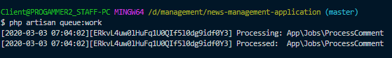
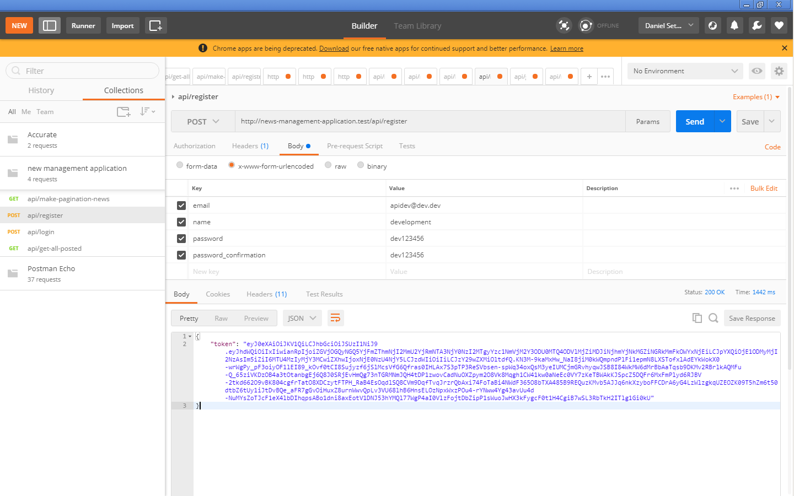
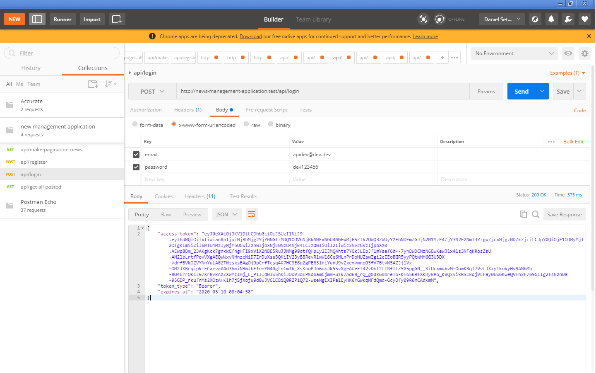

# Repository Application news managements


**Package dev-Depedencies**

- laravel passport
- Laravel 6.x
- Composer
- php 7.2.*
- Redis 3.0.5 (stable) version
- Nginx
- Valet
- Predis ^1
- etc.

**Redis running** : Testing Comments Queue using redis.



> Get started 

### Petunjuk (Registrasi User)
---
    Saya menyarankan untuk registrasi awal dengan Username/name (attribute):
      - users (non-admin)
      - admin (admin)
---
- **Refs middleware**
    - blob master at <a href="https://github.com/DBSetyawan/news-management-application/blob/master/app/Http/Middleware/SessionPrivilages.php" target="_blank">`SessionPrivilages`</a>

```php
    /**
     * logic process posted comments with image [fixed].
     *
     * @param  \Illuminate\Http\Request  $request
     * @param  @table.post.id -> $id
     * @return \Illuminate\Http\Response
     */
    public function UpdateChangedPosted(Request $request, $id){
        
        $input = $request->all();
        $post = Post::whereIn('id',[$input['post_id']])->first();

        if($request->hasFile('file'))
        {
            $image_name = $request->file('file')->getClientOriginalName();
            $filename = pathinfo($image_name,PATHINFO_FILENAME);
            $image_ext = $request->file('file')->getClientOriginalExtension();
            $fileNameToStore = $filename.'-'.time().'.'.$image_ext;
            $path = $request->file('file')->storeAs('public/News',$fileNameToStore);
           
        }  
            else {

                $fileNameToStore = $post->file;

        }

        $storagePath  = Storage::disk('public')->getDriver()->getAdapter()->getPathPrefix();
        $datapath = $storagePath.'News\\'.$post->file;

        if(file_exists($datapath)){
            Storage::delete($datapath);
            $post->file = $fileNameToStore;
            $post->save();
        }

        $data = Comment::where('id', $input['parent_id'])->update(['body' => implode('', $input['body'])]);
   
        event(new EventUpdatedPost($input));
                
        return back();

    }

     /**
     * Store a newly created resource in storage.
     *
     * @param  \Illuminate\Http\Request  $request
     * @return \Illuminate\Http\Response
     * @return \Illuminate\Http\ProcessComment Queue
     */
    public function store(Request $request)
    {
    	$request->validate([
            'body'=>'required',
        ]);
   
        $input = $request->all();
        $input['user_id'] = auth()->user()->id;
    
        $comment = Comment::create($input);

        ProcessComment::dispatch($comment);
            
        return back();
    }
```

### Petunjuk (Queue Comments)

    1. Install redis 3.0.5 (stable) from redis.io
    2. Masuk pada menu manage post.
    3. Berikan komentar pada post yang tersedia. 
    4. Comments Queue akan menunggu prosesnya 

***Tampilan Proses queue work berhasil dieksekusi***

[]() 

---
 
 **API docs with passport(DEFAULT)**

***Tampilan API registrasi***

[]() 

***Tampilan API login***

[]()

## RESPONSE JSON

- **RESPONSE API PAG at <a href="https://github.com/DBSetyawan/news-management-application/tree/a1fc5db66999665c1806e030cdf071ccf79208e2/public/json_response" target="_blank">`JSON RESPONSE`</a>**
    - [ GET ALL RESOURCES | MAKE PAGINATE POSTED COMMENTS ]
---

## Support

Reach out to me at one of the following places!

- Portfolio at <a href="https://dbsetyawan.github.io/portfolio" target="_blank">`Daniel Budi Setyawan`</a>
---

## License

[](http://badges.mit-license.org)

- **[MIT license](http://opensource.org/licenses/mit-license.php)**
- Copyright 2020 © <a href="https://dbsetyawan.github.io/portfolio" target="_blank">Daniel</a>.